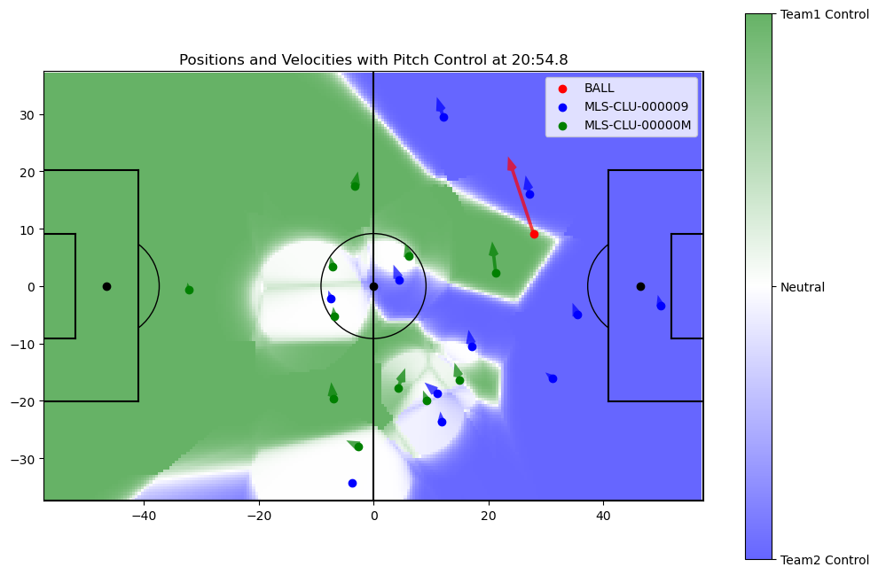
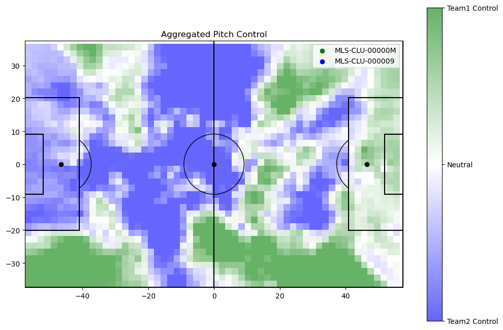

# Pitch Control Model for Soccer Analysis

## Overview

This repository contains the implementation of a pitch control model designed for soccer analysis. The model uses tracking data to calculate player control over specific areas of the pitch at various timestamps, providing insights into player positioning and decision-making dynamics during matches.

- **Pitch Control Heatmap**: The following image displays pitch control for a given timestamp during the game:

  

- **Aggregated Pitch Control Heatmap**: The following image shows pitch control for each team aggregated over the entire game:

  
  
## Key Features

- **Training Data**: The model is trained on **30 million rows of tracking data**, which includes player positions, ball positions, and velocities, collected at **3 million timestamps per game**.
- **Pitch Control Calculation**: For each timestamp, the model computes the likelihood of a player controlling a given area of the pitch.
- **Real-World Integration**: Successfully deployed and integrated into the analytics framework of **Nashville SC**.

## Project Structure

- **pitch_control_notebook-1.ipynb**: Contains the code to calculate and display pitch control.
- **velocity_calculation.py**: Calculates the velocity of each player at every timestamp during the game using their x and y positions during each frame. 
- **xml_to_csv_converter**: Processes the raw data file from each game and converts the data into a well-formatted csv file for analysis.
